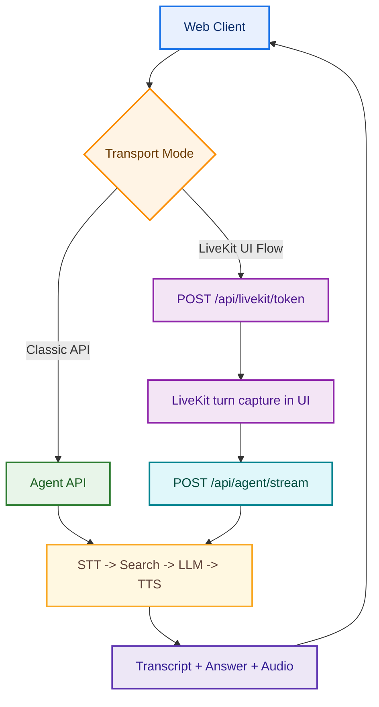

# Voice AI Agent Demo (Reliability + Observability)

Reference voice-agent demo that accepts audio input, transcribes speech, retrieves web context, generates an answer, and returns synthesized audio with production-style guardrails.

## Design and Architecture

- Full design/architecture document: [`docs/ARCHITECTURE.md`](docs/ARCHITECTURE.md)

### High-Level Architecture



For full component and sequence diagrams (including the LiveKit target architecture), see [`docs/ARCHITECTURE.md`](docs/ARCHITECTURE.md).

## Features

- Audio input from browser recording or uploaded file.
- Third-party STT (`OpenAI`).
- Search tool adapter (`Serper` web search).
- Pluggable LLM adapters (`OpenAI`, `Anthropic`).
- Third-party TTS (`OpenAI`).
- Per-stage reliability guardrails (timeouts + retries).
- Structured stage error codes (for debugging and incident triage).
- Request-level observability metadata (latencies, retries, total duration, request ID).
- In-memory failure counters via `/api/metrics`.
- Audio MIME allowlist validation.

## Quick Start

1. Install dependencies:

   ```bash
   npm install
   ```

2. Create environment file:

   ```bash
   cp .env.example .env
   ```

3. Configure `.env`:
   - `OPENAI_API_KEY` (required for STT + TTS + OpenAI LLM)
   - `SERPER_API_KEY` (optional but recommended for live search)
   - `ANTHROPIC_API_KEY` (needed only if selecting anthropic provider)
   - LiveKit (optional, needed for realtime room auth endpoint):
     - `LIVEKIT_URL`
     - `LIVEKIT_API_KEY`
     - `LIVEKIT_API_SECRET`
     - `LIVEKIT_DEFAULT_ROOM=voice-agent-room` (optional default room)
   - Model defaults:
     - `DEFAULT_LLM_PROVIDER=openai`
     - `DEFAULT_OPENAI_MODEL=gpt-3.5-turbo` (cost-safe default)
     - `DEFAULT_ANTHROPIC_MODEL=claude-haiku-4-5-20251001`
   - OpenAI model policy:
     - `OPENAI_SUPPORTED_MODELS` can include modern models that are known but disabled.
     - `OPENAI_ENABLED_MODELS` controls models allowed at runtime.
     - Disabled model selections return explicit `MODEL_DISABLED` errors (no silent downgrade).
   - Anthropic model gating:
     - `ANTHROPIC_ENABLED_MODELS=claude-haiku-4-5-20251001`
     - Leave empty to hide Anthropic from UI and API capabilities.
   - Reliability controls:
     - Timeouts: `STT_TIMEOUT_MS`, `SEARCH_TIMEOUT_MS`, `LLM_TIMEOUT_MS`, `TTS_TIMEOUT_MS`
     - Retries: `STT_RETRIES`, `SEARCH_RETRIES`, `LLM_RETRIES`, `TTS_RETRIES`

4. Start app:

   ```bash
   npm run dev
   ```

5. Open [http://localhost:3000](http://localhost:3000)

6. Run smoke tests:

   ```bash
   npm test
   ```

## API

### `POST /api/agent/turn`

`multipart/form-data` fields:
- `audio`: audio file (required)
- `llmProvider`: `openai` or `anthropic` (optional)
- `llmModel`: model override (optional)
- `ttsVoice`: tts voice override (optional)

Response:
- `requestId`
- transcript text
- search results
- AI answer
- base64 encoded audio output (`audioBase64`)
- observability metadata (`stageLatencyMs`, `retriesByStage`, `totalMs`)
- structured error responses with `code` and `stage`

### `POST /api/agent/stream`

`multipart/form-data` fields:
- `audio`: audio file (required)
- `llmProvider`: `openai` or `anthropic` (optional)
- `llmModel`: model override (optional)
- `ttsVoice`: tts voice override (optional)

Response stream:
- `status` events (`starting`, `transcribing`, `searching`, `answering`, `synthesizing_audio`)
- `transcript`
- `search_results`
- `answer`
- repeated `tts_audio_chunk` events (base64 audio chunks)
- `tts_complete`
- `done` (includes `requestId` + observability)
- `error` (includes structured `code` and `stage`)

### `POST /api/livekit/token`

Generates a short-lived LiveKit access token for browser room join.

`application/json` body (all optional):
- `room`: room name (defaults to `LIVEKIT_DEFAULT_ROOM`)
- `identity`: participant identity (auto-generated if omitted)
- `name`: display name (defaults to `identity`)

Response:
- `url`: LiveKit server URL (`wss://...`)
- `room`
- `identity`
- `name`
- `token`

### `GET /api/metrics`

Returns in-memory failure counters grouped by structured error code.

Example:
- `failureCounters.STT_TIMEOUT`
- `failureCounters.SEARCH_5XX`
- `failureCounters.MODEL_DISABLED`

## Notes

- `/api/agent/turn` returns full output in one payload.
- `/api/agent/stream` streams pipeline updates and audio chunks using SSE.
- Provider-specific default models are supported so Anthropic does not receive OpenAI model IDs.
- `/api/metrics` exposes in-memory failure counters by error code.
- Allowed input MIME types are validated (unsupported types return `UNSUPPORTED_AUDIO_MIME`, HTTP 415).

## Deploy on Render (Free Tier)

1. Push this project to a GitHub repo.
2. In Render dashboard, click **New +** -> **Blueprint**.
3. Connect the repo and select this project.
4. Render detects `render.yaml` automatically.
5. Set secret env vars in Render:
   - `OPENAI_API_KEY` (required)
   - `SERPER_API_KEY` (recommended)
   - `ANTHROPIC_API_KEY` (only if using anthropic provider)
   - `ANTHROPIC_ENABLED_MODELS` (only list models your Anthropic account can access)
6. Click **Apply** to deploy.

After deploy, open:
- `https://<your-render-url>/`
- health check: `https://<your-render-url>/api/health`
