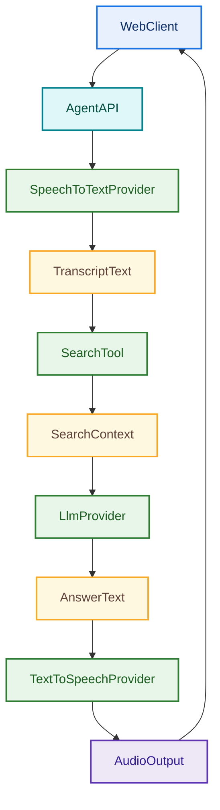
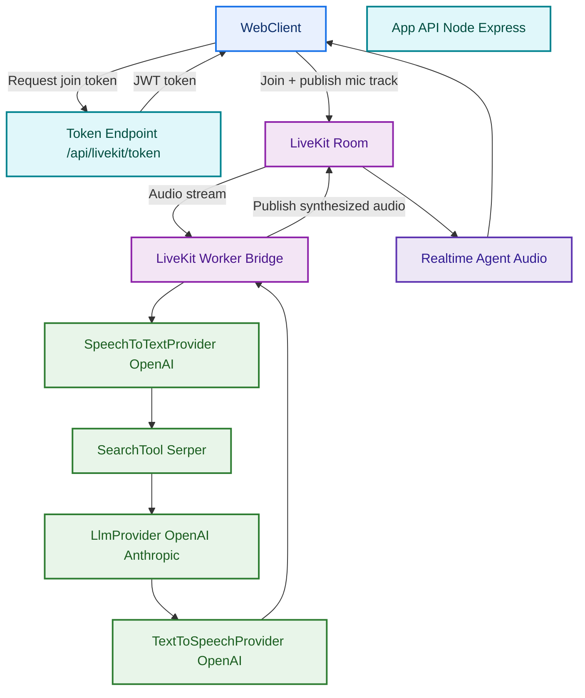
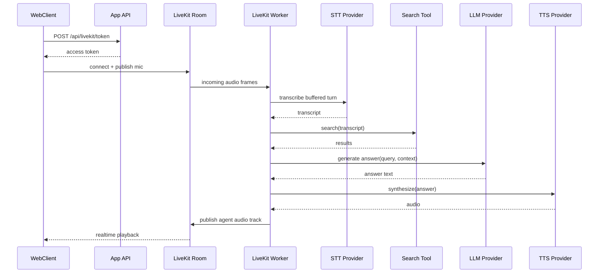
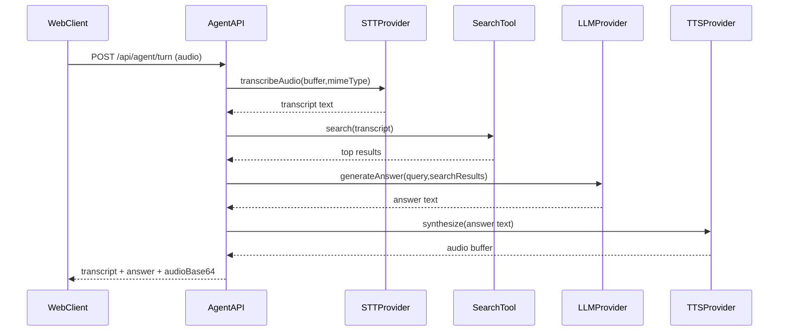
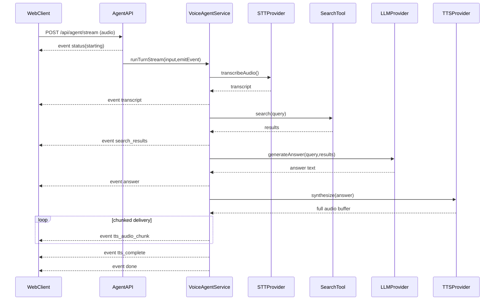

# Voice AI Agent Design and Architecture

## 1) Purpose

This project is a reference implementation for a **voice AI agent** that:

1. Accepts audio input from a user.
2. Converts speech to text using a third-party STT provider.
3. Performs search/tool retrieval to ground responses.
4. Generates an answer through a selectable LLM provider.
5. Converts the final answer back to speech with a third-party TTS provider.

The architecture is designed so provider integrations are replaceable with minimal code changes.

## 2) System Goals

- Provider-agnostic design for STT, LLM, search, and TTS.
- Fast local testing with a single Node service and browser client.
- Clear extension points for new model vendors and tools.
- Explicit, observable request flow for debugging and reliability.

## 3) High-Level Architecture (Classic API Path)

## 4) High-Level Architecture (LiveKit Realtime Path)

This variant keeps the same STT/Search/LLM/TTS business logic and introduces LiveKit for realtime media transport and session handling.

### LiveKit session sequence

## 5) Components

### 5.1 Frontend

- **File**: `public/index.html`
- Responsibilities:
  - Capture microphone audio or accept uploaded audio files.
  - Submit multipart requests to `/api/agent/turn` (single payload) or `/api/agent/stream` (SSE stream).
  - Display transcript, search results, generated answer, and streaming status stages.
  - Reconstruct audio from streamed chunks and play final synthesized output.

### 5.2 API Layer

- **File**: `src/server.js`
- Responsibilities:
  - Expose health and agent endpoints.
  - Validate audio request payload.
  - Coordinate service execution through `VoiceAgentService`.
  - Support both response modes:
    - Non-streaming JSON payload (`/api/agent/turn`).
    - `text/event-stream` SSE event delivery (`/api/agent/stream`).

### 5.3 Orchestration Service

- **File**: `src/services/voiceAgentService.js`
- Responsibilities:
  - Execute the full agent turn pipeline.
  - Resolve selected provider and model options.
  - Enforce deterministic sequence:
    - STT -> Search -> LLM -> TTS.

### 5.4 Provider Adapters

- STT interface + OpenAI adapter:
  - `src/providers/stt/base.js`
  - `src/providers/stt/openai.js`
- LLM interface + adapters:
  - `src/providers/llm/base.js`
  - `src/providers/llm/openai.js`
  - `src/providers/llm/anthropic.js`
- TTS interface + OpenAI adapter:
  - `src/providers/tts/base.js`
  - `src/providers/tts/openai.js`
- Search tool interface + Serper adapter:
  - `src/tools/search/base.js`
  - `src/tools/search/serper.js`

## 6) API Contract

### `POST /api/agent/turn`

- Content type: `multipart/form-data`
- Fields:
  - `audio` (required)
  - `llmProvider` (optional, example: `openai`, `anthropic`)
  - `llmModel` (optional override)
  - `ttsVoice` (optional override)

Response payload:

- `transcript`
- `query`
- `searchResults`
- `answer`
- `llm` metadata
- `tts` metadata
- `audioBase64`
- `audioMimeType`

### `POST /api/agent/stream`

- Content type (request): `multipart/form-data`
- Content type (response): `text/event-stream`
- Fields:
  - `audio` (required)
  - `llmProvider` (optional, example: `openai`, `anthropic`)
  - `llmModel` (optional override)
  - `ttsVoice` (optional override)

SSE event sequence:

- `status`: stage transitions such as `starting`, `transcribing`, `searching`, `answering`, `synthesizing_audio`
- `transcript`: transcript text + STT metadata
- `search_results`: query + result list
- `answer`: generated answer + LLM metadata
- `tts_audio_chunk`: base64 audio chunks with index
- `tts_complete`: TTS metadata and mime type
- `done`: terminal success event
- `error`: terminal error event

## 7) Runtime Sequence

### Streaming flow (`/api/agent/stream`)

## 8) Configuration

- **File**: `src/config.js`
- Environment variables:
  - `OPENAI_API_KEY`
  - `ANTHROPIC_API_KEY`
  - `SERPER_API_KEY`
  - `DEFAULT_LLM_PROVIDER`
  - `DEFAULT_LLM_MODEL`
  - `DEFAULT_TTS_VOICE`

Configuration is centralized so behavior can be changed without touching orchestration logic.

## 9) Extensibility Model

To add a new provider:

1. Implement the relevant interface (`SpeechToTextProvider`, `LlmProvider`, `TextToSpeechProvider`, or `SearchTool`).
2. Register the implementation in `buildService()` in `src/server.js`.
3. Expose provider selection in request options/UI if needed.
4. Add adapter-level tests and one end-to-end test path.

Because orchestration depends on interfaces (not concrete SDKs), provider swaps are low-impact.

## 10) Reliability and Security Considerations

- Validate file size and mime type for uploads.
- Add request and provider timeouts to avoid hanging turns.
- Avoid logging raw API keys or full sensitive payloads.
- Add request IDs for traceability across STT/search/LLM/TTS steps.
- Prefer `/api/agent/stream` for larger responses to avoid a large single JSON payload.

## 11) Known Limitations in Current Sample

- TTS provider call currently returns a full audio buffer before chunk emission starts (transport is streamed, generation is not provider-level incremental).
- Search currently uses one web adapter.
- No persistence layer for chat history or conversation memory.
- Minimal test coverage in this first iteration.

## 12) Suggested Next Architecture Iteration

- Upgrade to true provider-level streaming TTS (incremental synthesis + playback).
- Add optional streaming speech-to-text partial transcripts.
- Add tool-call policy controls (max tool hops, allow-list, timeout budgets).
- Add memory abstraction for multi-turn conversations.
- Add structured telemetry and dashboard-friendly logs.

